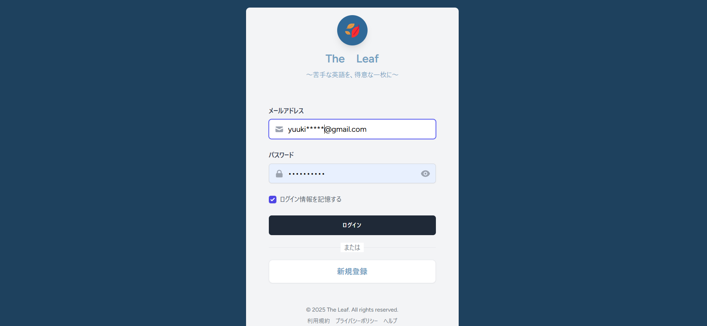
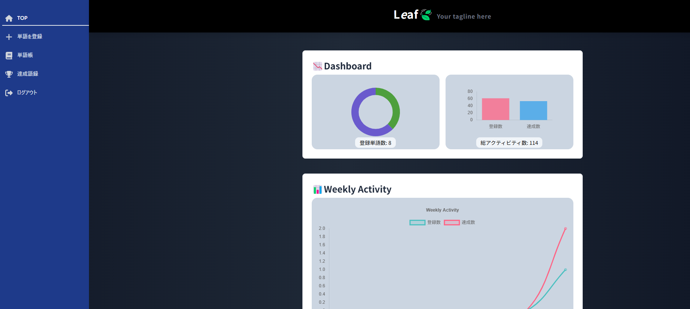
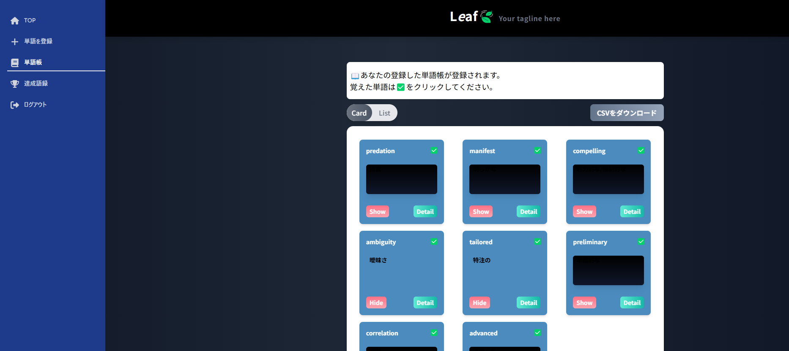
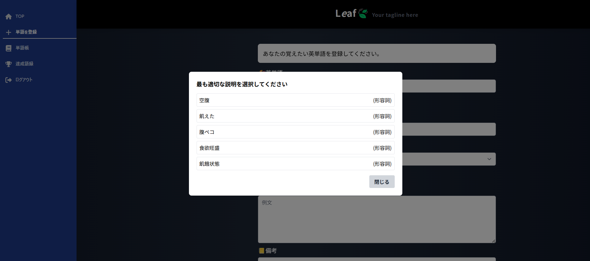
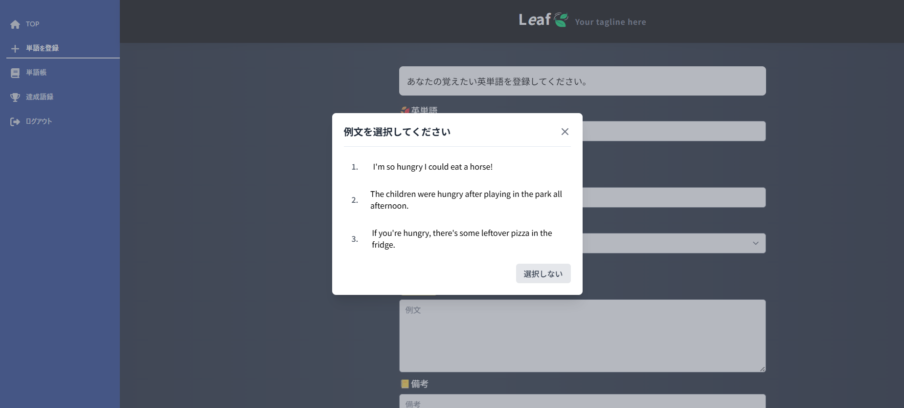
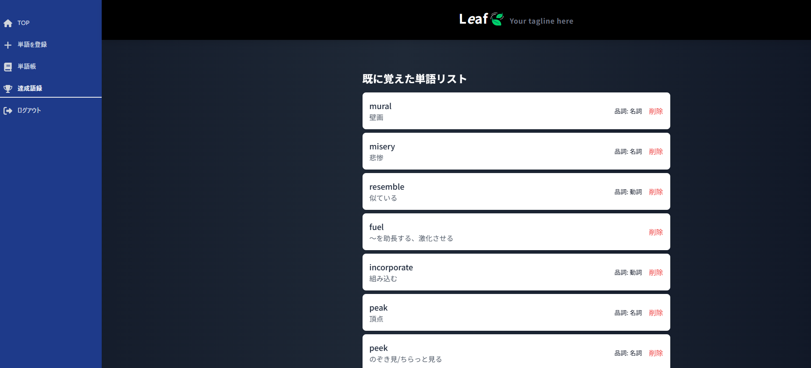
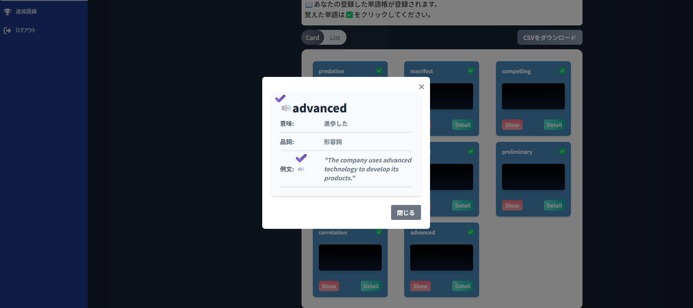

### 概要
英単語学習アプリ「Leaf」のアプリケーションリポジトリです。  
効率的かつ効果的な英単語学習をサポートします。

### 📷 アプリケーションのスクリーンショット

### 1. ログイン画面

アプリケーション起動時に表示される画面です。

### 2. ダッシュボード画面

ログイン後に最初に表示されるメイン画面です。直近一週間のアクティビティと、登録単語。達成単語の進捗をダッシュボードで表示します

### 3. カードによる暗記機能

単語やフレーズをカード形式で表示し、暗記をサポートする機能です。
隠したり、表示したりできます。
詳細画面に移動すると、登録した単語の品詞や例文も確認できます。

### 4. 生成AIによる日本語登録のアシスト機能

登録したい単語を入力した後にアシスト機能を使うと、生成AIによる候補が出ます。

### 5. 生成AIによる例文登録のアシスト機能

例文を登録したい場合も、同様に候補が出力されます。

### 6. 達成した単語のリスト

ユーザーがこれまでに登録した単語やフレーズのうち、覚えた単語の一覧を表示する画面です。復習の際に、便利です。

### 7. 登録した単語の音声発音機能

登録した単語の音声を出力します。発音の確認やシャドーイングに便利です。

### 使用している技術
- **バックエンド：** Laravel  
- **フロントエンド：** Vue、Typescript、TailwindCSS  
- **データベース：** MySQL
- **webサーバー：** Nginx
- **外部API：** GeminiAPI

### 使用しているデザインパターン
- **バックエンド:** Repository/Serviceパターン
、Serviceはビジネスロジックを担当
  
- **フロントエンド:** Atomic Design

### CI/CDパイプライン
Github Actionsを使用(workflow/ci.yml)
トリガー: mainブランチに対するpush、もしくはmainブランチに対するpull request
ビルドが通過すれば、herokuへプッシュ

---

### 🎨 採用しているデザインパターン

#### 🔧 バックエンド：Repository / Service パターン

- **Repository：** DB や外部APIなど、データアクセス層の責務を分離  
- **Service：** ビジネスロジックを担当  
- **Controller：** 入力の受け取りとエラーハンドリングを担当

#### アダプターパターン
- **Adapter:** 外部APIとの接続の際は、Adapterにラップ
ex)gemini

#### 🧱 フロントエンド：Atomic Design

| レイヤー     | 説明                                                                 |
|--------------|----------------------------------------------------------------------|
| **Atom**     | 単純なUIパーツ（ボタン、アイコンなど）                              |
| **Molecule** | 複数のAtomを組み合わせたUIパーツ（検索ボックスなど）                |
| **Organism** | ページ構成単位の複合パーツ（登録フォーム、モーダルの中身など）      |
| **Template** | レイアウトテンプレート（印刷対応や複雑なレスポンシブ構造時）         |
|

### 📄 ドキュメントリンク

- [要件定義](docs/要件定義.md)
- [テーブル定義](docs/テーブル定義.md)
